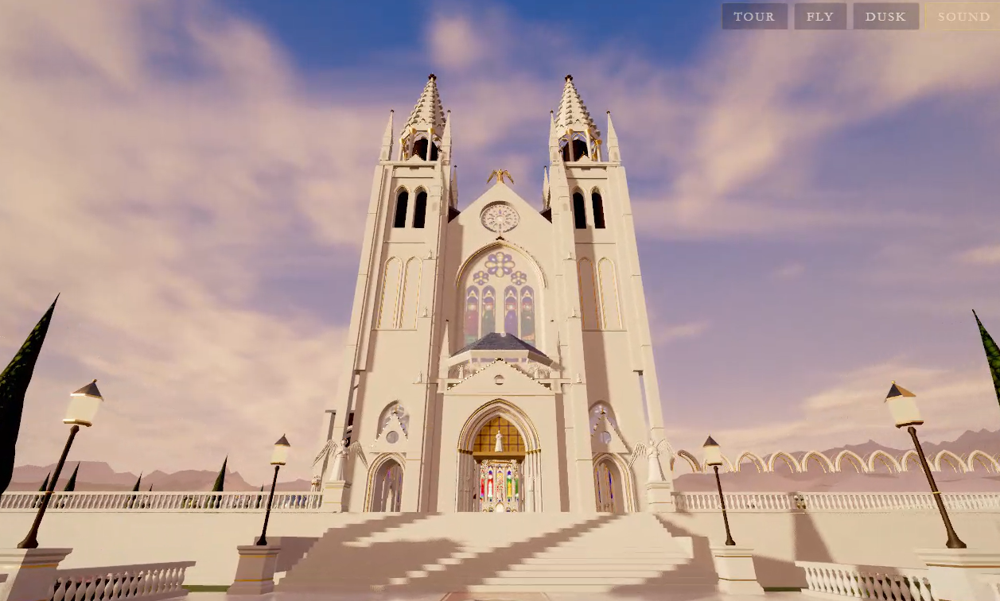
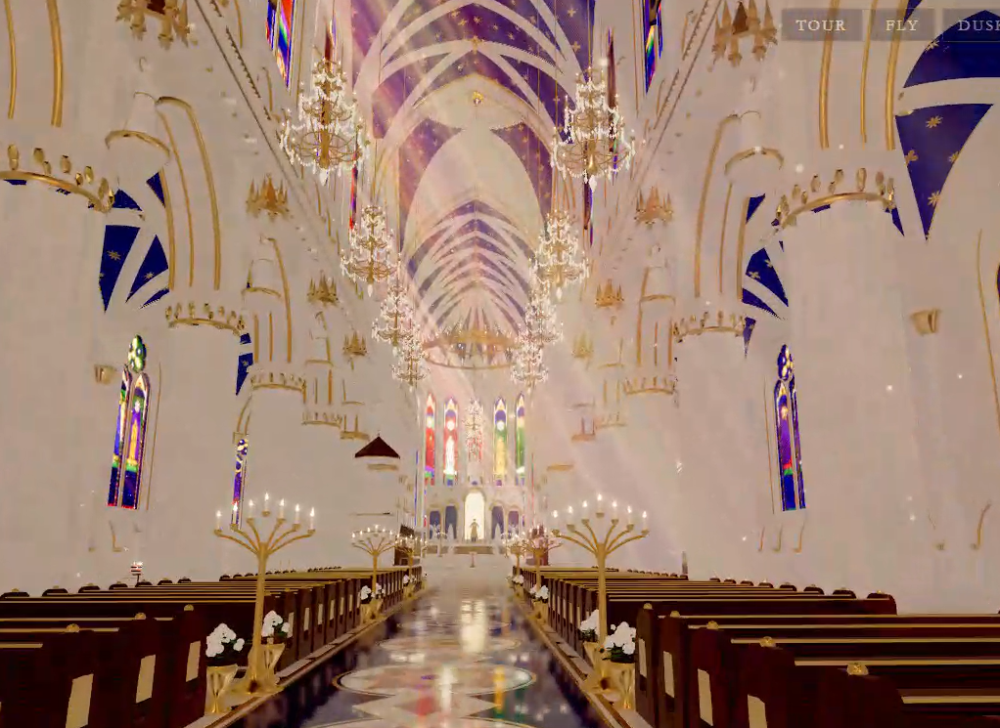

# Basilica of Celestial Light

**A fully procedural Gothic cathedral you can explore in your browser.**

Walk through the nave, climb the bell tower, visit the crypt and gardens, or let a guided tour take you through the basilica. The experience is built with Three.js: its architecture, stained glass, landscape, lighting, and soundscape are generated in code. The playable world uses no imported 3D models, image textures, or audio files.



*The west façade at dusk.*

## Explore

- **Walk freely** through the cathedral and its grounds, or take a **13-stop guided tour**.
- **Find the details:** light votive candles, ring the bell, and discover the Lady Chapel, crypt, cloister garden, and Tempietto.
- **Change the atmosphere** from dusk to night, switch on flight, hide the interface for photos, and adjust visual quality to suit your device.
- **Listen to a generated soundscape** of organ, choir, wind, water, birds, footsteps, and bells.



*The nave, looking toward the high altar.*

## Run locally

You need Node.js 20.19+ or 22.12+, a browser with WebGL 2, and a GPU. A recent integrated GPU works; software rendering is much slower.

```bash
git clone https://github.com/Token-Gremlin/gremlin-church.git
cd gremlin-church
npm ci
npm run dev
```

Open the local URL printed by Vite. The cathedral is generated in your browser when the page loads; then choose **Walk freely** or **Guided tour**.

To create an optimized static build, run `npm run build`. Run `npm run preview` to inspect it locally. The `dist/` directory can be hosted as a static site.

## Controls

| Input | Action |
| --- | --- |
| Click / Esc | Capture / release the mouse |
| W A S D or arrow keys | Walk |
| Shift | Run |
| Mouse wheel | Zoom |
| E | Interact with nearby objects |
| T | Start or leave the guided tour |
| Left / right arrow during the tour | Skip between stops |
| F | Toggle flight; Space / C to rise / descend |
| N | Switch between dusk and night |
| M | Toggle sound |
| Q | Cycle visual quality |
| P | Toggle photo mode |
| H | Show controls |

On touch devices, use the on-screen stick to move and drag to look around.

## Performance

The default quality is **High** on desktop and **Low** on touch devices. Dynamic resolution adjusts to the frame rate; if performance stays low, the renderer can step down a quality level unless you selected one yourself.

Use `?q=low`, `?q=medium`, `?q=high`, or `?q=ultra` to choose a starting quality. For software rendering or older hardware, try `?lite&q=low`.

## How it works

The project combines parametric Gothic geometry, generated canvas and shader materials, painted stained glass, procedural terrain, volumetric light, reflections, and WebAudio synthesis. The main systems live in `src/arch/`, `src/world/`, `src/textures/`, `src/engine/`, `src/audio/`, and `src/ui/`.

## License

Released under the [MIT License](LICENSE). Copyright © 2026 Token Gremlin.
